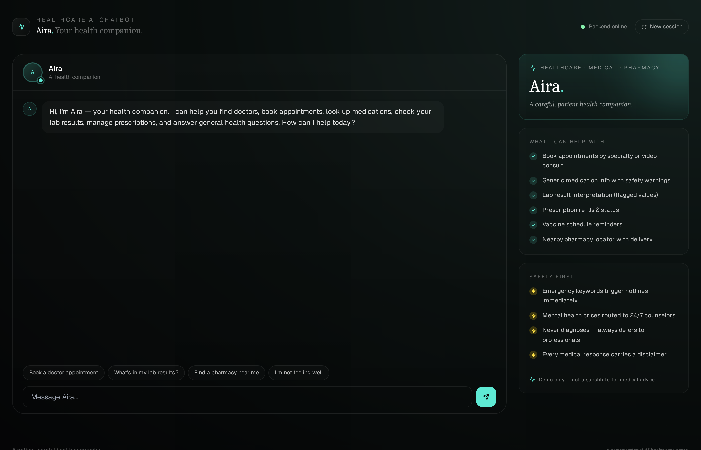
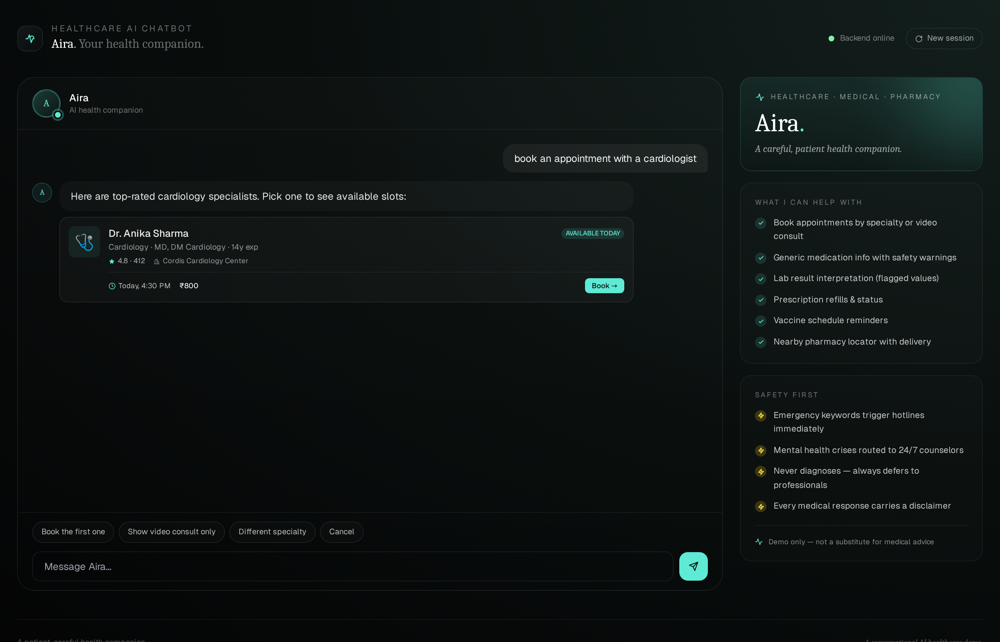
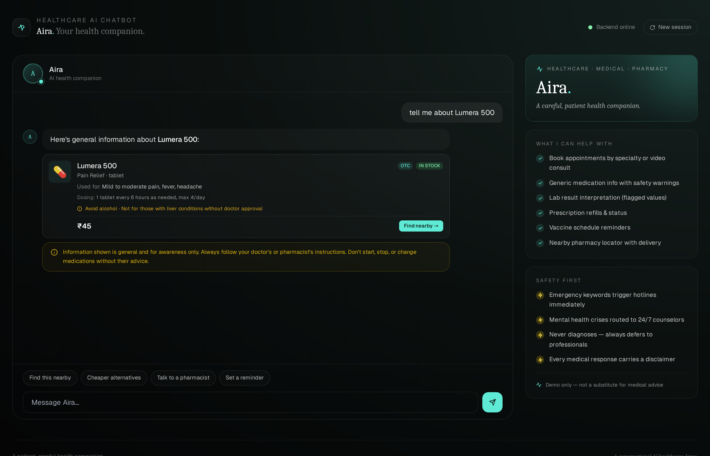
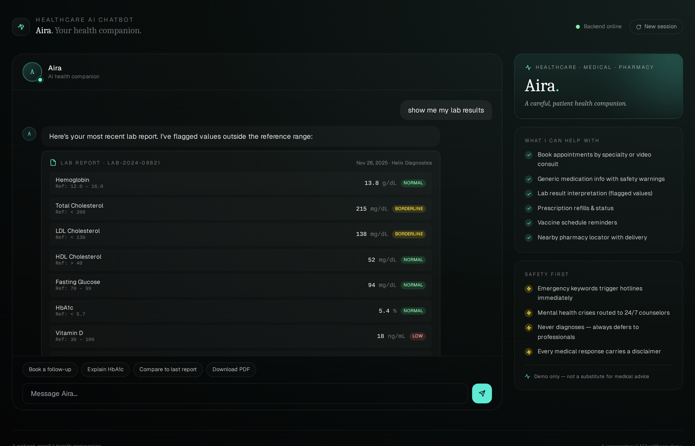
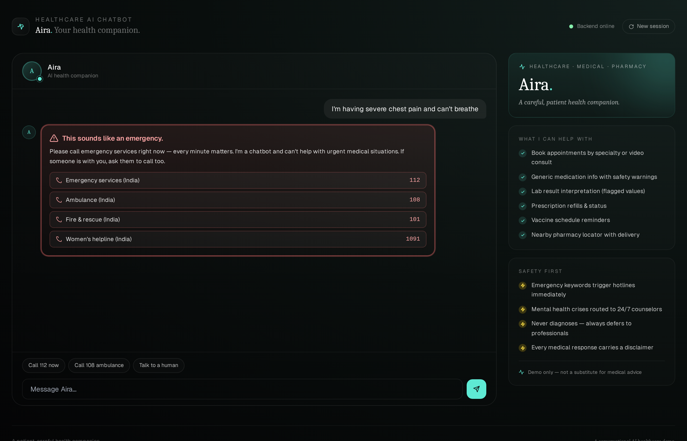

# DRC Healthcare AI Chatbot

> A full-stack conversational AI assistant for **healthcare, medical, and pharmacy services** — Python FastAPI backend + React frontend.

[](https://github.com/drcinfotech/Healthcare-AI-Chatbot/actions/workflows/ci.yml)
[](LICENSE)
[](https://www.python.org/)
[](https://nodejs.org/)
[](https://fastapi.tiangolo.com/)
[](https://react.dev/)
[](https://tailwindcss.com/)

A production-shaped demo of an AI chatbot built specifically for healthcare. The bot, *DRC*, can book doctor appointments, look up medications, surface lab results, manage prescriptions, locate nearby pharmacies, handle vaccine schedules, and — critically — **detect medical emergencies and mental-health crises and route users to hotlines immediately**. Everything runs locally with **zero external API keys**.

## 📸 Preview



<details>
<summary>More screenshots</summary>

### Doctor search


### Medication info with safety warnings


### Lab results with color-coded status


### Emergency detection (safety guardrail)


</details>

---

## ✨ What it does

| Capability | Example user message | What happens |
| --- | --- | --- |
| **Book appointment** | *"book a cardiologist for tomorrow"* | Filters doctors by specialty, returns 3 available with ratings, slots, and Book buttons |
| **Find a doctor** | *"I need a dermatologist"* | Same as above, sorted by availability today + rating |
| **Symptom check** | *"I have a headache and feel feverish"* | Surfaces GP options + safety reminders, never diagnoses |
| **Medication info** | *"tell me about Lumera 500"* | Generic info card: uses, dosing, side effects, warnings + disclaimer |
| **Medication search** | *"I need allergy medicine"* | Returns 3 OTC/Rx options in that category with stock indicators |
| **Prescription refill** | *"refill my prescription"* | Shows active Rx list, flags ones needing refill, offers pharmacy choice |
| **Lab results** | *"show my blood test"* | Renders results table with normal/borderline/high/low color-coded badges |
| **Vaccine schedule** | *"when is my flu shot due"* | Status timeline: completed / due soon / overdue / recommended |
| **Pharmacy locator** | *"find a pharmacy near me"* | Top 3 by distance + open status, delivery times, services |
| **Insurance info** | *"is this covered by my insurance"* | General guidance + offer to send cashless pre-auth |
| **Video consult** | *"can I do an online consult"* | Returns video-eligible doctors with mode badges |
| **Mental health support** | *"I've been feeling anxious"* | Empathetic response + offers therapist + crisis hotlines (proactive) |
| **🚨 Medical emergency** | *"I have crushing chest pain"* | **Short-circuits everything** — shows red emergency block with 112/108 hotlines |
| **🚨 Crisis** | *"I want to end my life"* | **Short-circuits everything** — shows India mental-health crisis hotlines |
| **Talk to human** | *"connect me to a nurse"* | Offers nurse / pharmacist / callback routing |

Every response can include **rich blocks** — text, doctor cards, medication cards, lab tables, vaccine timelines, pharmacy locators, appointment slots, emergency alerts, and yellow disclaimer banners — rendered as distinct React components.

---

## 🛡️ Safety-first design

This is the **most important difference** from a generic chatbot. Before any intent classification, every message passes through `safety.py`:

```
   ┌──────────────────────────┐
   │   User sends a message   │
   └────────────┬─────────────┘
                │
                ▼
   ┌──────────────────────────┐    YES  ┌────────────────────────────┐
   │  Emergency keywords?     ├────────►│ Return EmergencyBlock with │
   │  (chest pain, stroke,    │         │ India hotlines (112, 108)  │
   │   overdose, unconscious) │         │ — no intent dispatch       │
   └────────────┬─────────────┘         └────────────────────────────┘
                │ NO
                ▼
   ┌──────────────────────────┐    YES  ┌────────────────────────────┐
   │  Mental health crisis?   ├────────►│ Return EmergencyBlock with │
   │  (suicide, self-harm,    │         │ iCall, Vandrevala, AASRA   │
   │   "want to die")         │         │ — empathetic, no advice    │
   └────────────┬─────────────┘         └────────────────────────────┘
                │ NO
                ▼
   ┌──────────────────────────┐
   │  Classify intent         │
   │  Dispatch to handler     │
   │  Append DisclaimerBlock  │
   │  for medical responses   │
   └──────────────────────────┘
```

The bot **never**:
- Diagnoses a condition
- Recommends a dosage outside catalog defaults
- Tells anyone to stop their prescribed medication
- Replaces a doctor's judgment

The bot **always**:
- Surfaces a disclaimer for medical info
- Routes urgent cases to hotlines
- Encourages professional consultation

---

## 🏗️ Architecture

```
┌─────────────────────────────┐         ┌──────────────────────────────┐
│  React Frontend             │         │  Python FastAPI Backend       │
│  ───────────────            │  HTTP   │  ────────────────────         │
│  • Chat UI                  │ ──────► │  • Safety guardrails (FIRST)  │
│  • 11 rich block types      │  /chat  │  • Intent classifier          │
│  • Suggestion buttons       │ ◄────── │  • Entity extraction          │
│  • Session-aware            │  JSON   │  • Catalog (30 meds, 12 docs, │
│  • Vite proxy → :8000       │         │    5 pharmacies)              │
│                             │         │  • In-memory sessions         │
└─────────────────────────────┘         └──────────────────────────────┘
        Port 5173                                  Port 8000
```

### Block types rendered by the frontend

| Block | Purpose |
| --- | --- |
| `text` | Regular conversational reply with **bold** support |
| `disclaimer` | Yellow medical disclaimer — required for medical info |
| `emergency` | Red high-priority alert with tappable hotline numbers |
| `doctors` | Doctor cards: specialty, rating, next slot, fee, Book button |
| `medications` | Medication cards: uses, dosing, side effects, Rx/OTC + stock badges |
| `pharmacies` | Pharmacy cards: distance, open status, delivery ETA |
| `lab_results` | Test table with normal / borderline / high / low color badges |
| `vaccine_schedule` | Timeline with completed / due_soon / overdue / upcoming status |
| `prescriptions` | Active Rx list with refill status and prescribing doctor |
| `appointment_slots` | 2×2 grid of bookable time slots |
| `appointment_confirmed` | Green confirmation card with full booking details |

---

## 🚀 Quick Start

### Option A — Docker (fastest)

```bash
docker compose up --build
```

Open <http://localhost:5173>. Backend docs at <http://localhost:8000/docs>.

### Option B — Manual

Two terminals — backend and frontend.

**Prerequisites:** Python 3.10+, Node 18+

**Terminal 1 — Backend:**
```bash
cd backend
python -m venv venv

# macOS/Linux
source venv/bin/activate
# Windows (PowerShell)
.\venv\Scripts\Activate.ps1

pip install -r requirements.txt
uvicorn main:app --reload --port 8000
```

You should see `Uvicorn running on http://127.0.0.1:8000`. Visit `/docs` for the interactive API.

**Terminal 2 — Frontend:**
```bash
cd frontend
npm install
npm run dev
```

The browser opens at <http://localhost:5173>.

---

## 🗂️ Project Structure

```
healthcare-ai-chatbot/
├── README.md
├── LICENSE                          MIT
├── CONTRIBUTING.md
├── .gitignore  .dockerignore
├── docker-compose.yml               One-command full-stack launch
│
├── .github/
│   ├── workflows/ci.yml             Tests + frontend build
│   ├── ISSUE_TEMPLATE/
│   └── PULL_REQUEST_TEMPLATE.md
│
├── docs/
│   └── screenshots/                 Demo screenshots go here
│
├── backend/                         Python FastAPI
│   ├── Dockerfile  .env.example
│   ├── main.py                      Routes
│   ├── requirements.txt
│   ├── test_chatbot.py              31 tests
│   ├── app/
│   │   ├── safety.py                Emergency + mental-health detection
│   │   ├── intents.py               17 intent classifier
│   │   ├── chatbot.py               Engine + handlers
│   │   ├── catalog.py               Data loader
│   │   ├── sessions.py              In-memory store
│   │   └── models.py                Pydantic schemas
│   └── data/
│       ├── medications.json         30 fictional meds
│       ├── doctors.json             12 fictional doctors
│       └── pharmacies.json          5 fictional pharmacies
│
└── frontend/                        React + Vite + Tailwind
    ├── Dockerfile  nginx.conf  .env.example
    ├── index.html  vite.config.js
    ├── tailwind.config.js  postcss.config.js
    ├── package.json
    ├── public/favicon.svg
    └── src/
        ├── main.jsx  App.jsx
        ├── api.js  index.css
        └── components/Blocks.jsx    11 block renderers
```

---

## 🧠 How the chatbot thinks

When a user sends a message:

1. **Safety pass** — `app/safety.py` checks for emergency or crisis patterns. If matched, returns the appropriate hotline block immediately and stops. This is the most important step.
2. **Classify intent** — `app/intents.py` scores the message against every intent's regex patterns (worth 2.0) and keywords (worth 0.6). Top scorer wins.
3. **Extract entities** — specialty (cardiology, derm, etc.), medication category (pain, allergy, etc.), symptoms, and known medication names.
4. **Dispatch to a handler** — `app/chatbot.py` routes to a handler that builds appropriate rich blocks and follow-up suggestions.
5. **Append a disclaimer** — for any medical-info response, a `DisclaimerBlock` is included automatically.
6. **Update session** — remember last doctors/medications shown for follow-ups.
7. **Return JSON** — the frontend renders each block via `Blocks.jsx`.

The pipeline runs in ≤5 ms.

---

## 🧪 Testing

```bash
cd backend
pytest -v
```

**31 tests pass**, covering:
- Catalog integrity (counts + no real brand names)
- Safety: chest pain, stroke, overdose, unconscious, suicide ideation, self-harm
- Safety false-positive checks (normal queries don't trigger emergency)
- Intent classification across all 17 intents
- API endpoints
- Required disclaimers on medical responses

---

## 📡 API Reference

The backend auto-publishes OpenAPI docs at `/docs` when running.

### `POST /chat`
```json
// Request
{ "message": "book a cardiologist", "session_id": "optional" }

// Response
{
  "session_id": "kJ8x2pQrL...",
  "intent": "book_appointment",
  "confidence": 0.92,
  "blocks": [
    { "type": "text", "content": "Here are top-rated..." },
    { "type": "doctors", "items": [ ... ] }
  ],
  "suggestions": ["Book the first one", "Show video consult only", "..."],
  "safety_flag": null
}
```

If `safety_flag` is `"emergency"` or `"mental_health"`, the response was short-circuited by the safety layer and the only block will be `emergency` type.

### Other endpoints

- `GET /health` — liveness probe (`{status, medications, doctors}`)
- `GET /doctors?specialty=cardiology` — directory filter
- `GET /doctors/{id}` — single doctor
- `GET /medications?category=pain_relief` — catalog filter
- `GET /medications/{id}` — single medication
- `GET /pharmacies` — nearby pharmacies

---

## 🎨 Design

The frontend leans into a refined, dark-mode aesthetic that says "premium healthcare" without falling into clichés:

- **Typography**: *Instrument Serif* (display) + *Geist* (body) + *JetBrains Mono* (data)
- **Off-black canvas** (`#050506` → `#14201E` radial gradient) with subtle grain texture
- **Teal accent** (`#5EEAD4`) — calming, clinical, distinct from typical "hospital blue"
- **Status color system**: green for normal/healthy/in-stock, yellow for borderline/due-soon, red for emergency/overdue, with proper semantic meaning throughout
- **Animated typing dots** and fade-in messages
- **Mobile-aware** layout (chat panel stacks on small screens)

---

## 📦 Production Notes

This is a demo. For a real healthcare deployment:

- **Persistence**: replace `sessions.py` (in-memory dict) with Redis/PostgreSQL
- **PHI handling**: real Protected Health Information needs HIPAA-compliant infrastructure, audit logs, encryption at rest, and BAA-covered cloud
- **LLM upgrade**: swap rule-based classifier for an LLM call, but keep the safety layer at the front — never let an LLM gate emergency routing
- **Authentication**: session IDs here are unsigned tokens; use proper JWT/OAuth and patient identity verification
- **Catalog source**: load from a real EHR/pharmacy database, not JSON files
- **Localization**: many users in India speak Hindi, Gujarati, Tamil — i18n the strings and consider regional hotlines
- **Rate limiting**: add slowapi or a reverse-proxy limiter for `/chat`
- **Deployment**:
  - Backend → Fly.io, Railway, Render, or any container host
  - Frontend → Vercel, Netlify, Cloudflare Pages (set `VITE_API_BASE` to your deployed backend)

---

## ⚖️ License

MIT — see [LICENSE](LICENSE).

---

## ⚠️ Disclaimers

- **This is a demo, not medical software.** It is not certified, not regulated, not validated for clinical use, and not a substitute for professional medical advice, diagnosis, or treatment.
- All medication names, doctor names, pharmacy names, lab values, prescription IDs, and tracking numbers in this project are **entirely fictional**. Any resemblance to real entities is coincidental.
- *DRC*, the bot persona, is fictional.
- Emergency hotline numbers are for India; verify and adapt for your region.
- Built as a teaching demo for safe-by-design healthcare conversational AI architecture.

---

## 🙏 Credits

Built with FastAPI, React, Vite, Tailwind CSS, and Lucide icons.
